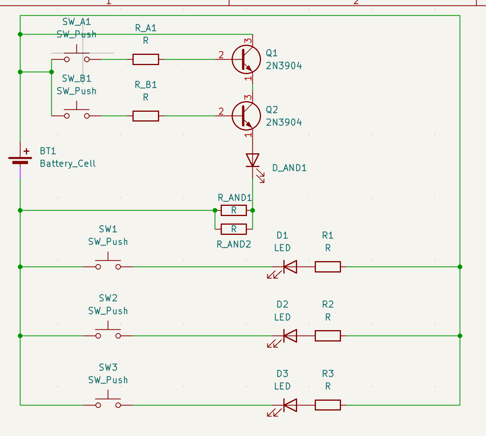
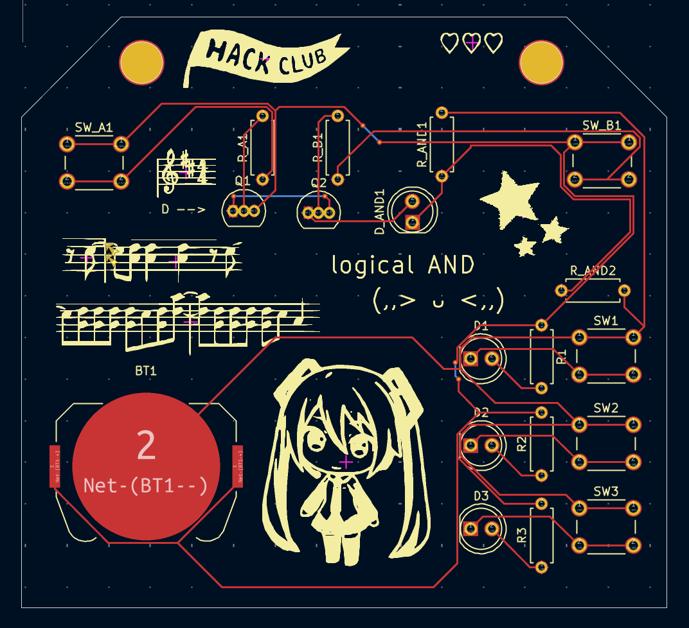

# first PCB board

there is kind of a song that goes with it :)

### What is it?
There's two parts to the circuit, basically. One part is a logical AND (I hope)
The other 3 lights are just controlled by separate buttons, respectively.

### Bill of materials
- 5 buttons (6mm tactile ones)
- 4 LEDS (5mm)
- 1 (one) 3V battery + battery holder
- 6 resistors , 220 ohm
- 2 NPN transistors 

My slack username is Eucatastrophe right now

Here's my ID

U0925Q3PB0Q

